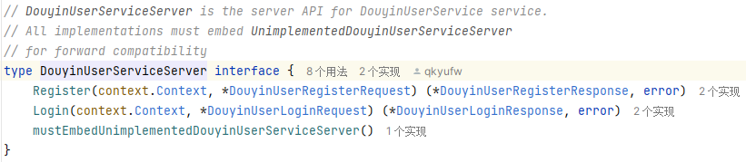
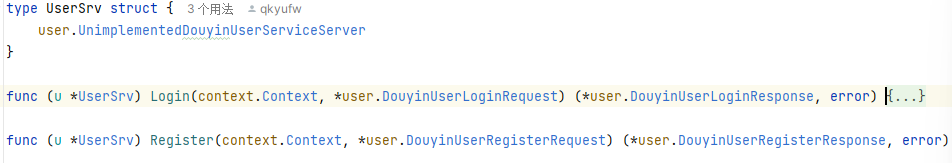

# dzug
### 抖声 demo

### 文件架构说明：

1. app：网关以及各个服务
    1. gateway：网关
        1. cmd包：启动模块
        2. handlers包：handler方法
        3. routes：路由
        4. rpc包：远程调用方法
    2. relation包：关系服务
        1. cmd包：启动模块
        2. service包：业务处理，处理远程的调用，这里直接返回数据，之后可以接上数据库等进行完善
    3. user包：用户服务
        1. 同relation
2. conf包：配置文件
    1. config.go：配置管理模块
    2. config.yaml：存储服务配置，为保证数据安全，**未上传**，可使用下面文件模板
    3. config.yaml.example：config.yaml的模板，**去掉example，修改配置即可运行配置**

3. discovery包：服务注册发现模块
    1. discovery.go：服务发现
    2. initDiscovery.go：初始化一个服务发现程序
    3. initRegister.go：初始化服务注册模块
    4. register.go：服务注册
4. doc：文档和图片等
5. logger：日志模块
    1. logger.go：日志管理程序
    2. douyin.log：存储日志数据，**未上传**

6. protosl包：grpc远程调用生成文件

### 配置要求：

需要安装etcd并启动服务
1. etcd端口：使用默认2379端口
2. user服务：使用9000端口
3. relation服务：使用9001端口

### 启动：

在三个cmd文件下的main.go文件直接进行启动即可，postman输入对应的连接可以进行调用。

**注意**，protoc生成的pb.go文件给json添加了omitempty参数，不按照正确json格式在postman里进行调用也能正常运行，==测试只要链接正确就可以返回数据==。

以上部分已更新，以下为demo中的服务调用流程：

## demo中微服务调用流程

### gateway

gateway用来处理网关相关操作

1. main.go：启动路由程序
2. router.go：路由注册，绑定handlers中的handler
4. handler.go：被调用后会调用rpc.go进行远程调用
5. rpc.go：每当rpc程序被调用一次，都会从etcd中查找新的grpc链接，然后进行rpc远程调用

### user

1. main.go：启动etcd服务与grpc服务，然后进行监听
2. service.go：等待被远程调用
3. …：可以写更多的方法来进行调用，比如写dao包来被service操作，处理数据库相关的内容
4. …：可以调用discovery包下的initDiscovery.go 的Init()方法，调用其他服务的方法，如relation的rpc方法（未测试）

## 开发新服务的建议流程（以comment服务为例）

1. 在protos包新建comment.proto，编写proto文件
2. 通过protoc命令生成comment.pb.go与comment_grpc.pb.go文件，并放置在protos下的comment文件夹下（目前没有就新建）
3. 在app包建comment文件夹
4. cmd包放置 main.go（仅作参考）
5. service放置rpc函数，需要继承comment_grpc.pb.go文件夹下的DouyinCommentServiceServer 接口（这个名字写法，只是参照我的写法，可能叫别的名字）
   
   如，这里的的service包下的UserSrv结构体就继承了对应的包
6. main函数写法，参照任意一个即可，etcd端口号与你的etcd端口相同，一般本地的不改动，都是localhost:2379，ServiceRegister这里的Value用一个新的端口，不然无法注册服务，net.Listen里的端口号与value保持一致，其他几乎不用改动，当然，除了把service.UserSrv{}注册的那个位置，要用正确的
5. service文件夹放置rpc函数（模仿写即可），需要继承comment_grpc.pb.go文件夹下的DouyinCommentServiceServer 接口（这个名字写法，只是参照我的写法，可能叫别的名字）
   
   如，这里的的service包下的UserSrv结构体就继承了对应的包
6. main函数写法，参照任意一个服务模块写即可，
    1. 1、2、部分全部都一样（后面可以考虑合并代码，使main更简洁）
    2. key为模块名，value为服务地址（每个都不一样，不然无法注册服务），其他几乎不用改动
    3. 当然，除了把service.UserSrv{}注册的那个位置，要用正确的进行绑定（即倒数第二行代码）
    4. 简而言之，main函数，可以直接复制粘贴，key和value要重新设置，key为你的服务名，要用来grpc调用，value为本服务的地址每个都不能相同，还有倒数第二行，绑定自己的服务

