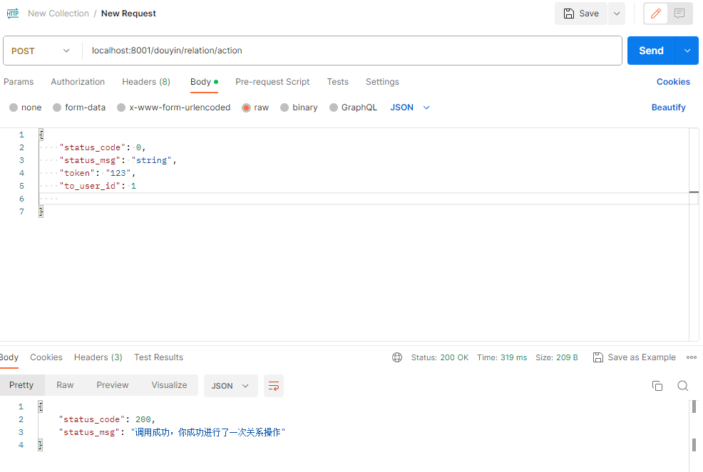

# dzug
### 抖声 demo

此demo使用框架为 grpc+etcd+gin，使用etcd来进行服务注册发现，主要使用两个服务，来测试服务注册与发现功能，其他功能基本没有实现

### 主要使用接口为

1. [/douyin/user/login](https://apifox.com/apidoc/shared-09d88f32-0b6c-4157-9d07-a36d32d7a75c/api-50707522)
2. [/douyin/user/register](https://apifox.com/apidoc/shared-09d88f32-0b6c-4157-9d07-a36d32d7a75c/api-50707521)
3. [/douyin/relation/action](https://apifox.com/apidoc/shared-09d88f32-0b6c-4157-9d07-a36d32d7a75c/api-50707530)

前两者用于登录注册，最后者用于关注和取关
拆分两个微服务，12为用户服务，3为关系服务

### demo完成进度：

1. 可使用etcd完成服务注册与发现，但是细节有待完善
2. 无数据库，服务端直接返回测试数据
3. 两项服务均可进行测试
4. 主要实现了服务器外进行调用，服务与服务之间的rpc调用以及服务注册相关操作暂未实现
5. jwt验证等中间件暂时没有管

### 文件架构说明：

1. app：网关以及各个服务
    1. gateway：网关
        1. cmd：启动模块
        2. http：handler方法
        3. routes：路由
        4. rpc：远程调用方法
    2. relation：关系服务
        1. cmd：启动模块
        2. service：业务处理，处理远程的调用，这里直接返回数据，之后可以接上数据库等进行完善
    3. user：用户服务
        1. 同relation
2. discovery：服务注册发现模块
    1. discovery.go：服务发现
    2. register.go：服务注册
3. idl：grpc远程调用生成文件

### 配置要求：

需要安装etcd并启动服务

1. etcd端口：使用默认2379端口
2. user服务：使用9000端口
3. relation服务：使用9001端口

### 启动：

在三个cmd文件下的main.go文件直接进行启动即可，postman输入对应的连接可以进行调用。

注意，protoc生成的pb.go文件给json添加了omitempty参数，不按照正确json格式在postman里进行调用也能正常运行，只需要链接正确即可。

